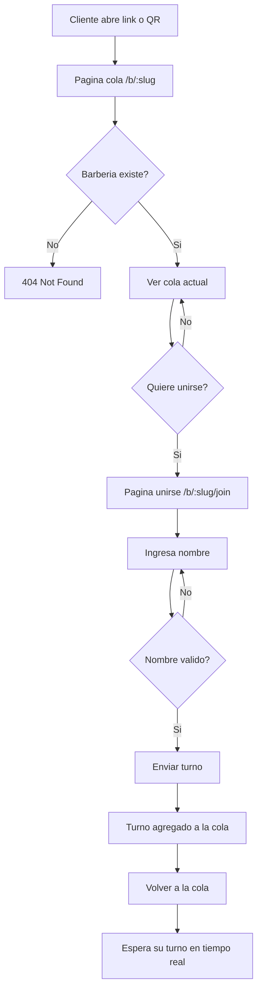
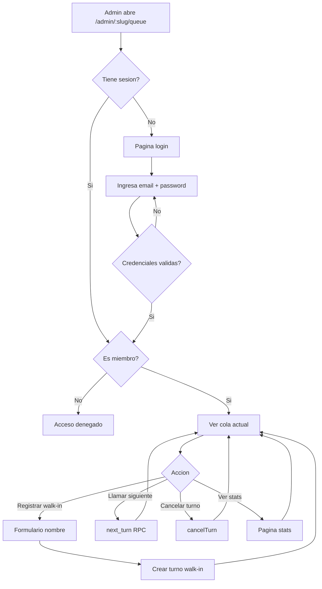
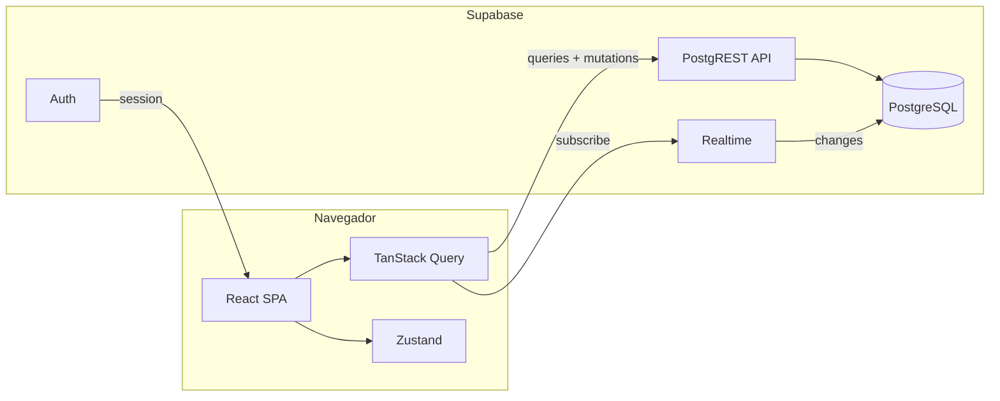
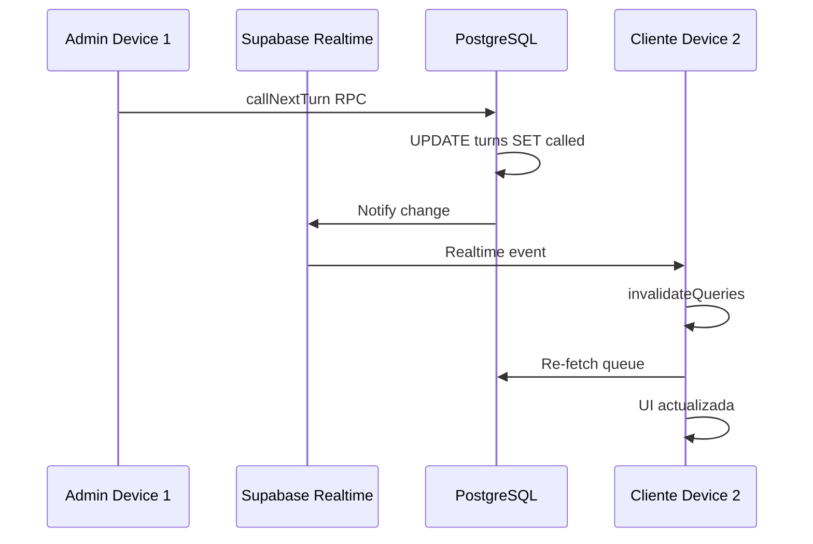
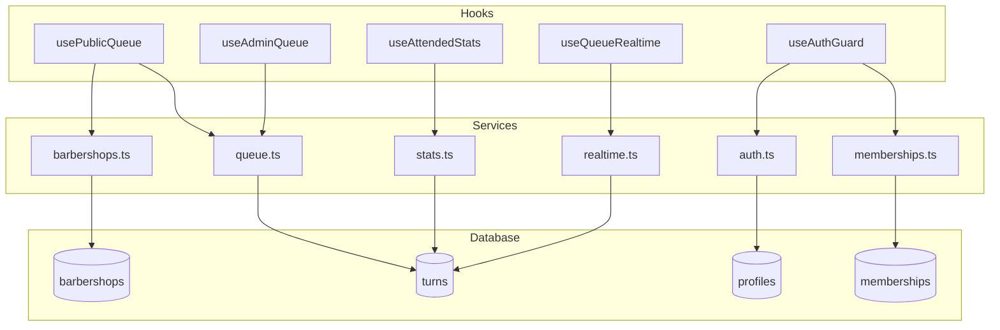
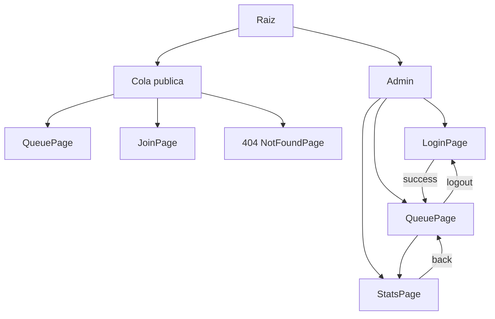

# HayTurno — Diagramas de Flujo y Arquitectura

## Flujo del usuario público

## Flujo del admin

## Arquitectura del sistema

## Sincronizacion realtime

## Flujos de datos

## Estructura de navegacion

